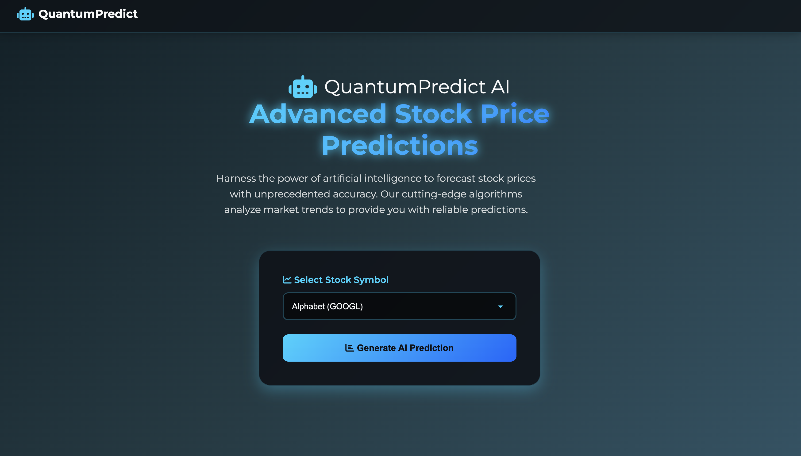
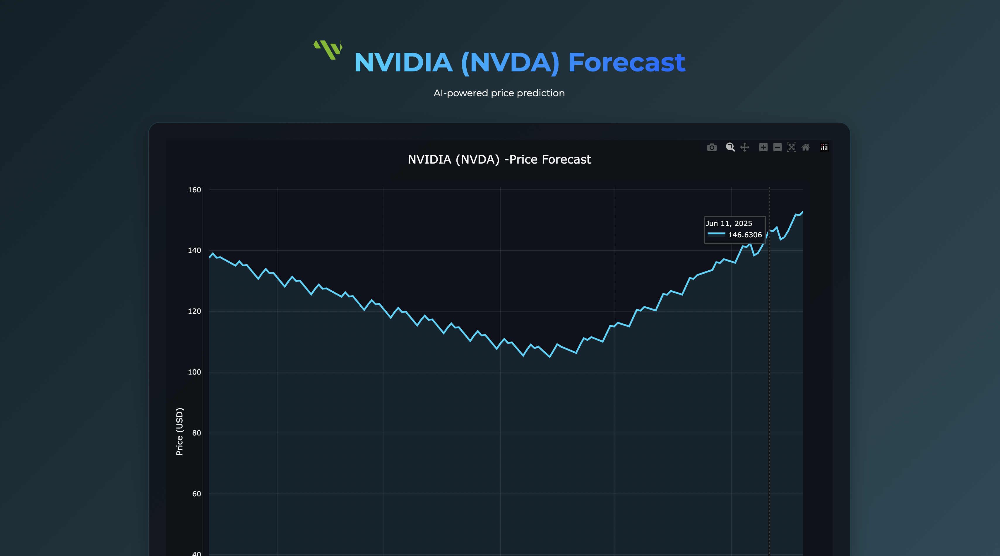
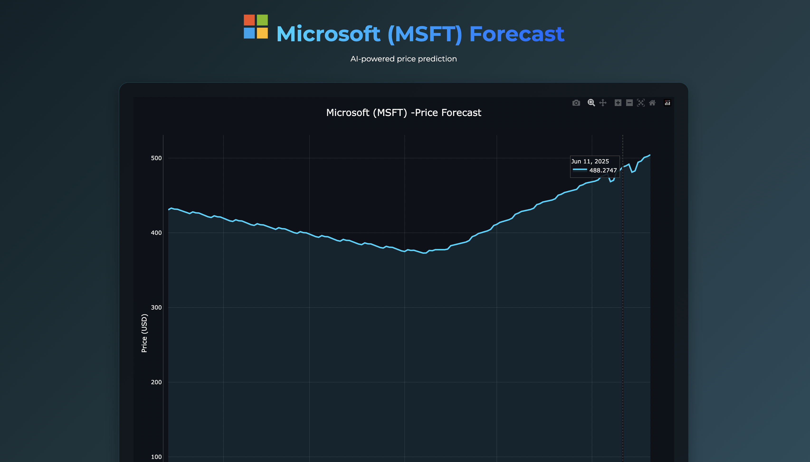

# 📈 Time Series Forecasting Web API


This is a **FastAPI-based** web application that predicts future stock prices using historical data. It leverages **ARIMA** and **Facebook Prophet** models trained on data fetched from **Yahoo Finance (`yfinance`)**, exposing powerful forecasting APIs with interactive docs.

---

## 📸 Screenshots

Here are some screenshots of the web app in action, showing the FastAPI interface and example outputs.

| FastAPI Landing Page          |  Forecast Response    | Forecast Response           |
|---------------------------|-----------------------------|-----------------------------|
|  |  |  |

> 📁 All screenshots are saved inside the `screenshots/` folder.

---

## 🚀 Features

- 🟢 FastAPI endpoints for clean and fast API access
- 📈 Combined use of ARIMA and Prophet for time series forecasting
- 🔗 Real-time historical stock data fetched with `yfinance`
- 📊 Interactive OpenAPI documentation (`/docs`)
- 📁 JSON and plot outputs served dynamically

---

## 🧠 Models & Data Sources Explained

### 🔮 Prophet (by Meta/Facebook)

Prophet is an **additive regression model** designed for **time series forecasting** focusing on business data. It decomposes data into:

- **Trend:** Long-term increase or decrease patterns
- **Seasonality:** Periodic effects (daily, weekly, yearly)
- **Holiday effects:** Custom events impacting series behavior

**Strengths:**

- Handles **missing data** and **outliers** robustly
- Supports **non-daily data** frequencies
- Provides **uncertainty intervals** (confidence bounds)
- Detects **automatic changepoints** to adapt to trend shifts

Used here to learn complex seasonal trends in stock prices and forecast future values.

---

### 🧮 ARIMA (AutoRegressive Integrated Moving Average)

ARIMA models univariate stationary time series through three components:

- **AutoRegressive (AR):** Dependency on lagged observations
- **Integrated (I):** Differencing to remove trends/non-stationarity
- **Moving Average (MA):** Dependency on lagged forecast errors

**Details:**

- Requires stationary or differenced data
- Parameters `(p, d, q)` control AR order, differencing level, MA order
- Implemented via Python’s `statsmodels` library
- Suitable for data with autocorrelations and consistent seasonality

In this project, ARIMA offers a classical statistical forecasting approach complementary to Prophet.

---

### 💰 YFinance API (Yahoo Finance Data Fetching)

`yfinance` is a Python library wrapping Yahoo Finance APIs to retrieve market data:

- Downloads **daily OHLCV** data (Open, High, Low, Close, Volume)
- Supports **custom date ranges** and intervals
- Returns data as a **pandas DataFrame** for seamless analysis
- Accesses additional financial info like dividends and splits

Example usage:

```python
import yfinance as yf

# Fetch Apple stock data from 2015 to 2024
data = yf.download("AAPL", start="2015-01-01", end="2024-12-31")

print(data.head())
